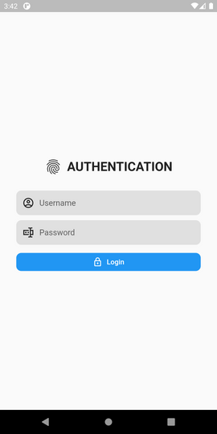
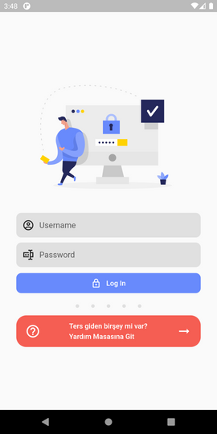

# DfApi Authentication
dfapi_auth, kullanıcının dfapi ile kimlik doğrulamasını sağlayan flutter paketidir.

### Kullanım
Uygulamanızı DfApiAuth Widget' ı ile sarmalayarak uygulamanıza authentication yapısını eklemiş olursunuz.

DfApiAuth, DfApiAuthRequest tipinde bir parametreye ihtiyaç duyar.

```dart
//DfApiAuthRequest


class DfApiAuthRequest {
  final Widget child;
  final AuthConfig configuration;
  final Widget loginWidget;
  final Widget loadingWidget;
  final Widget splashWidget;
  Function(String, DfApiUserInfo) callBack;

  DfApiAuthRequest({
    @required this.child,
    @required this.configuration,
    this.loginWidget,
    this.loadingWidget,
    this.splashWidget,
    Function(String, DfApiUserInfo) callBack,
  }) : this.callBack = callBack;
}

```

DfApiAuthRequest' in child ve configuration adında iki zorunlu parametresi vardır.


<br><br>

---
**Configuration:** <br>
AuthConfig tipinde, uygulamanın kimlik doğrulama için kullanılacak end-point bilgilerini barındırır.

```dart
  AuthConfig({
    @required String address,
    String loginPath = "auth/login",
    String refreshTokenPath = "auth/refreshToken",
    String logoutPath = "",
  })
```

Zorunlu olan address parametresi, auhtentication işleminin yapılacağı sunucu adresidir. Diğer alanlar ise hangi end-point' lerden bu işlemlerin yapılacağını belirtir. Login ve refresh token end-pointleri için AuthController isminde bir controller' ın olduğu varsayılarak, default değerler verilmiştir. Kendi yapınıza göre değiştirebilirsiniz. 

---


<br>

---

**Child:**<br> 
Kimlik doğrulamasından sonra yönlendirilecek olan sayfa. Örnek olarak uygulamanın anasayfası olabilir.

---

<br>

---

**LoginWidget:**<br>
 Eğer kullanıcının giriş yapacağı ekranı özelleştirmek isterseniz kendi tasarımınızı bu parametreyi kullanarak uygulayabilirsiniz.

 **Varsayılan ve Özelleştirilmiş Örnek Ekran**<br><br>
  


<br>
---

---
Diğer loading ve splash parametreleride aynı login mantığında mantıkta çalışmaktadır. Tamamen süreçleri özelleştirmek için kullanılır. Boş geçilirse varsayılan değerler atanır.

---

<br>

---
**CallBack**<br>
Kullanıcı giriş yaptıktan sonra token veya kullanıcı bilgilerine ihtiyacınız varsa request' te bulunan callBack parametresine ***Function(String, DfApiUserInfo)*** tipinde fonksiyon geçirilerek token ve kullanıcının claims gibi diğer bilgilerine ulaşabilirsiniz.

callBack fonskiyonundan alınan token aşağıdaki gibi api çağrılarında kullanılmak üzere ayarlanabilir.

```dart
...

child: DfApiApp(
  request: DfApiAuthRequest(
    ...
    callBack: apiHelperInitializer,
    ...
  ),
),

...

void apiHelperInitializer(String token, DfApiUserInfo userInfo) {
  if (GetIt.I.isRegistered<ApiHelper>()) return;

  var uri = Uri.parse("api url");
  List<ApiHelperPathItem> paths = [
    ApiHelperPathItem.get("Key", "Path/SamplePath"),
  ];

  var apiHelper = ApiHelper.setup(
    uri,
    token,
    paths,
    responseResolverFunc: (json) => (json) { //... },
  );
  GetIt.I.registerLazySingleton<ApiHelper>(() => apiHelper);
}

```

Api çağrıları için ***api_helper*** paketi kullanılabilir. 

https://pub.dev/packages/api_helper

---

<br>

Uygulama agacı içerisinde, farklı yerlerde oturum açan kullanıcının bilgilerine veya kullanıcı ile ilişkili token' a ihtiyacınız olabilir. Bu durumda ***DfApiAppFunctions*** tipindeki yardımcı class kullanılabilir. Bu class' a DfApiApp içerisindeki functions alanı ile erişilir.

Kendi login ekranınızı tasarladıysanız eğer login işlemini tetiklemek için yine bu sınıftaki login metodu kullanılabilir.

Örnek: 

```dart
  var token = await DfApiApp.functions.getToken();
  //ya da
  token = DfApiApp.token;
``` 
 


<br><br>
**En temel hali ile aşağıdaki gibi kullanılabilir**

```dart
  
  return MaterialApp(
    //...
    home: DfApiApp(
      request: DfApiAuthRequest(
        configuration: AuthConfig(address: "adress"),
        child: HomePage() //--> Authentication sonraso yönlendirilecek olan widget.
      )
    )
  
```

<br>

**Özelleştirmek istenirsede aşağıdaki gibi kullanılabilir.**

```dart
  
  return MaterialApp(
    //...
    home: DfApiApp(
      request: DfApiAuthRequest(
        configuration: AuthConfig(
          address: "adress"
        ),
        child: HomePage(),
        loginWidget: LoginPage(),
        loadingWidget: Loading(),
        callBack: apiHelperInitializer,
      )
    )
  
```
